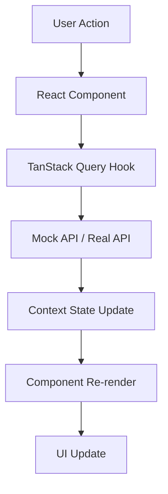

# AI2RampOptimizer Dashboard - Noerpel Demo

A modern, responsive dashboard for optimizing ramp/dock operations in logistics centers using AI-powered multi-agent systems. Built for Noerpel Group as a proof-of-concept demonstration.


## 🌟 Features

### Core Functionality
- **Real-time Dock & Truck Management**: Monitor dock status, truck arrivals, and queue management
- **AI-Powered Recommendations**: Multi-agent system providing intelligent dock assignments with confidence scores
- **Dual Operating Modes**: 
  - Integrated mode (with CargoClix/LFS V8)
  - Standalone mode (manual/Excel import)
- **Live Activity Feed**: Real-time agent activity monitoring
- **KPI Dashboard**: Track wait times, overtime reduction, dock utilization, and monthly savings
- **ROI Comparison**: Before/after analysis showing potential savings
- **Simulation Scenarios**: Test different scenarios (traffic jams, staff absence, etc.)

### UI/UX
- **Fully Responsive**: Optimized for desktop, tablet, and mobile devices
- **Dark Theme**: Modern glassmorphism design with gradient accents
- **Internationalization (i18n)**: Seamless German/English language switching (default: German)
- **Drag & Drop**: Intuitive truck-to-dock assignment
- **Real-time Updates**: Live data refresh and simulation

### Technical Highlights
- **TypeScript**: Full type safety across the application
- **TanStack Query**: Efficient data fetching and caching
- **Context API**: Centralized demo mode and state management
- **Tailwind CSS v4**: Modern utility-first styling
- **Lucide Icons**: Clean, consistent iconography

## 📋 Prerequisites

Before running this application, ensure you have the following installed:

- **Node.js**: v18.0.0 or higher ([Download](https://nodejs.org/))
- **npm**: v9.0.0 or higher (comes with Node.js)
- **Git**: For cloning the repository ([Download](https://git-scm.com/))

To verify your installations:
```bash
node --version
npm --version
git --version
```

## 🚀 Getting Started

### 1. Clone the Repository

```bash
git clone https://github.com/shreyasbkai2c/noerpel-dashboard-v1.git
cd noerpel-dashboard-v1
```

### 2. Install Dependencies

```bash
npm install
```

This will install all required packages including:
- React & React DOM
- TypeScript
- Vite
- TanStack Query
- i18next
- Tailwind CSS
- Lucide React icons

### 3. Run the Development Server

```bash
npm run dev
```

The application will start on [http://localhost:5173](http://localhost:5173)

You should see output similar to:
```
  VITE v7.2.6  ready in 500 ms

  ➜  Local:   http://localhost:5173/
  ➜  Network: use --host to expose
  ➜  press h + enter to show help
```

Open your browser and navigate to the URL shown.

### 4. Build for Production

To create an optimized production build:

```bash
npm run build
```

The build output will be in the `dist/` folder. You can preview the production build with:

```bash
npm run preview
```

## 🗂️ Project Structure

```
noerpel-dashboard-v1/
├── src/
│   ├── api/                      # API hooks and mock data
│   │   ├── hooks/
│   │   │   └── use-ramp-optimizer.ts
│   │   └── mock-data.ts
│   ├── components/               # React components
│   │   ├── ramp-optimizer/       # Domain-specific components
│   │   │   ├── agent-overview.tsx
│   │   │   ├── agent-activity-feed.tsx
│   │   │   ├── dock-grid.tsx
│   │   │   ├── kpi-row.tsx
│   │   │   ├── language-switcher.tsx
│   │   │   ├── mode-toggle.tsx
│   │   │   ├── recommendation-panel.tsx
│   │   │   ├── roi-comparison.tsx
│   │   │   ├── simulation-panel.tsx
│   │   │   ├── site-selector.tsx
│   │   │   └── truck-list.tsx
│   │   └── ui/                   # Reusable UI components
│   ├── contexts/                 # React contexts
│   │   └── demo-mode-context.tsx
│   ├── i18n/                     # Internationalization
│   │   ├── locales/
│   │   │   ├── de.json
│   │   │   └── en.json
│   │   └── index.ts
│   ├── lib/                      # Utilities
│   │   ├── design-tokens.ts
│   │   └── utils.ts
│   ├── types/                    # TypeScript type definitions
│   │   └── ramp-optimizer.ts
│   ├── views/                    # Main views
│   │   └── ramp-optimizer-view.tsx
│   ├── index.css                 # Global styles & Tailwind
│   ├── App.tsx                   # Root component
│   └── main.tsx                  # Entry point
├── public/                       # Static assets
├── dist/                         # Production build (generated)
├── index.html                    # HTML template
├── package.json                  # Dependencies & scripts
├── tsconfig.json                 # TypeScript configuration
├── tailwind.config.js            # Tailwind CSS configuration
├── vite.config.ts                # Vite configuration
└── README.md                     # This file
```

## 🛠️ Available Scripts

| Command | Description |
|---------|-------------|
| `npm run dev` | Start development server with hot reload |
| `npm run build` | Build for production (TypeScript compile + Vite build) |
| `npm run preview` | Preview production build locally |
| `npm run type-check` | Run TypeScript type checking |
| `npm run lint` | Run ESLint to check code quality |

## 🔧 Configuration

### Environment Variables

Currently, the application uses mock data and doesn't require environment variables. For production deployment with real APIs, create a `.env` file:

```env
VITE_API_BASE_URL=https://your-api-endpoint.com
VITE_CARGOCLIX_API_KEY=your-api-key
```

Access in code:
```typescript
const apiUrl = import.meta.env.VITE_API_BASE_URL;
```

### Customization

- **Language**: Default language is set to German. Change in `src/i18n/index.ts`
- **Theme Colors**: Modify in `src/index.css` under `@theme` directive
- **Mock Data**: Edit demo scenarios in `src/api/mock-data.ts`

## 🌐 i18n (Internationalization)

The application supports German and English:

- Translation files: `src/i18n/locales/de.json` and `src/i18n/locales/en.json`
- Switch language using the DE/EN toggle in the top-left corner
- Default language: German

To add a new language:
1. Create a new JSON file in `src/i18n/locales/`
2. Add it to `src/i18n/index.ts`
3. Update the `LanguageSwitcher` component

## 📊 Data Flow



## 🎨 Design System

The dashboard uses a custom dark theme with:
- **Primary Colors**: Blue gradients (#3b82f6 to #8b5cf6)
- **Secondary Colors**: Purple accents
- **Typography**: Inter, JetBrains Mono (monospace for metrics)
- **Effects**: Glassmorphism, subtle animations, responsive shadows

## 🧪 Demo Features

The demo includes:
- **6 AI Agents**: Data, Analysis, Prediction, Recommendation, Learning, Orchestrator
- **8 Docks** (Ulm site): Standard, Heavy, and Cooling types
- **6 Incoming Trucks**: Various carriers and cargo types
- **4 Active Recommendations**: With confidence scores and impact metrics
- **Simulation Scenarios**: Traffic jams, staff absence, early arrivals, peak times

## 📦 Tech Stack

| Technology | Version | Purpose |
|------------|---------|---------|
| React | 19.0.0 | UI Framework |
| TypeScript | 5.7.2 | Type Safety |
| Vite | 7.2.6 | Build Tool HMR |
| TanStack Query | 5.66.2 | Data Fetching & Caching |
| i18next | 24.2.0 | Internationalization |
| Tailwind CSS | 4.1.0 | Styling |
| Lucide React | 0.555.0 | Icons |

## 🚧 Known Limitations (Demo)

- Currently uses mock data (no real API integration)
- Simulated real-time updates (not actual WebSocket connections)
- Limited to predefined sites and scenarios

## 📝 License

This is a proprietary demo created for Noerpel Group by AI2Connect GmbH.

© 2025 AI2Connect GmbH, Dortmund

## 🤝 Support

For questions or issues, contact:
- **Project**: AI2RampOptimizer
- **Client**: Noerpel Group
- **Developer**: AI2Connect GmbH

---

**Note**: This is a demonstration/proof-of-concept application. For production deployment, additional security, authentication, and API integration would be required.
